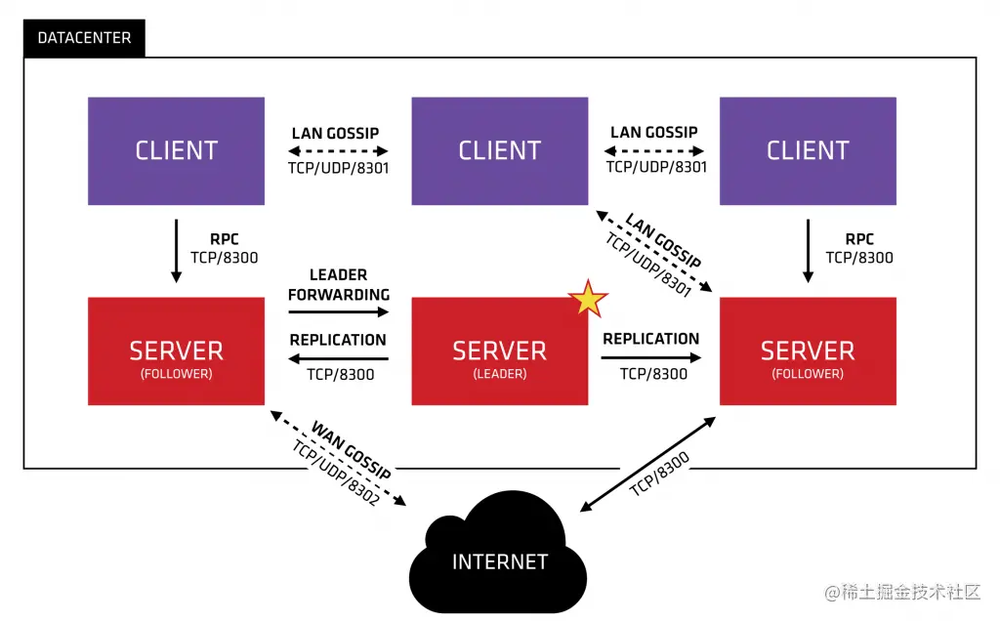

# Consul 安装

本文档包含：
- 在一台linux上配置、部署consul server (以开发模式)
- 使用UI、CLI和API与consul server交互

---

资源链接：
- [Consul API doc](https://developer.hashicorp.com/consul/api-docs)


## 1. 安装

[安装地址](https://developer.hashicorp.com/consul/downloads)

```shell
# 验证
$ consul -v                     
Consul v1.16.1
Revision e0ab4d29
Build Date 2023-08-05T21:56:29Z
```

## 2. 运行 Consul Agent
下载的consul二进制可以运行在server或client模式下，但都叫做agent。

consul提出一个数据中心（DC）概念，
在一个生产的DC环境中，至少有3个server进程（组成高可用集群），而client必须部署在每个虚拟机节点都部署一个。

### 2.1 Server模式
生产环境至少3个（可以5个），开发环境可以是1个。server负责核心数据的存储和处理请求，只有一个Server是leader角色，通过raft共识算法选举产生。

leader节点负责数据写入，然后同步到其他follower节点。

单数据中心的架构图：


### 2.2 Client模式
运行在 client 模式时，它是一个轻量级进程，提供服务注册、健康检查和服务器见的查询转发。

### 2.3 以开发模式启动Server
这样启动的agent同时具备Server和Client功能。

- [Consul: Agent启动参数](https://developer.hashicorp.com/consul/docs/agent#common-configuration-settings)

```shell
# 以阻塞方式启动，通过ctrl-c退出;  --node 指定当前节点名称
$ consul agent -dev --node=dev_host -ui
==> Starting Consul agent...
               Version: '1.16.1'
            Build Date: '2023-08-05 21:56:29 +0000 UTC'
               Node ID: 'd6a77241-6bb5-7d1d-22ee-77814bba6601'
             Node name: 'dev_host'
            Datacenter: 'dc1' (Segment: '<all>')
                Server: true (Bootstrap: false)
           Client Addr: [127.0.0.1] (HTTP: 8500, HTTPS: -1, gRPC: 8502, gRPC-TLS: 8503, DNS: 8600)
          Cluster Addr: 127.0.0.1 (LAN: 8301, WAN: 8302)
...
```
可以看到一个Agent启动会占用以下端口：
- Client Addr：`HTTP: 8500, HTTPS: -1, gRPC: 8502, gRPC-TLS: 8503, DNS: 8600`
- Cluster Addr：`LAN: 8301, WAN: 8302`

**Server模式启动**
```shell
# 一些参数可以通过cli参数或配置文件的方式传入
$ consul agent -config-file=server.json
```

**Client模式启动**
```shell
# 一些参数可以通过cli参数或配置文件的方式传入
$ consul agent -config-file=client.json

# 或者读取一个目录下的所有JSON或HCL配置
$ consul agent -config-dir configs
```

### 2.4 查看集群成员
```shell
# 加-detailed 获得详细
$ consul members                          
Node      Address         Status  Type    Build   Protocol  DC   Partition  Segment
dev_host  127.0.0.1:8301  alive   server  1.16.1  2         dc1  default    <all>
```
CLI的输出基于gossip协议，是结果一致性，不一定是Server目前的真实状态，通过HTTP API获得强一致性的信息：
```shell
$ curl localhost:8500/v1/catalog/nodes
```
作为对HTTP API的补充，DNS接口也能查询consul成员信息：
```shell
$  dig @127.0.0.1 -p 8600 dev_host.node.consul
```

### 2.5 停止Agent

对于Client：
通过Ctrl-C来平滑退出集群，并从catalog中移除。如果是后台运行的consul，可通过`consul leave`
或`kill -INT $PID`来平滑退出。
>Client是否平滑退出对集群不会产生影响

对于Server：
无论是否平滑退出都不会让它被标记为`left`状态，而是`failed`状态，这将最低限度对共识过程产生影响。
通过`consul force-leave`命令来从集群中彻底删除一个server节点（当这个节点确实不再需要）。

### 2.6 重新加载配置
```shell
$ consul reload
```
当然，dev模式启动无任何配置。

### 2.7 查询所有启动的服务
```shell
# consul本身也作为一个服务
$ consul catalog services
consul
```

### 2.8 UI管理
访问 `http://localhost:8500/ui`

## 3. 服务注册

### 3.1 定义服务
可以通过JSON/YAML/HCL几种方式定义一个或多个服务，一般是每个服务一个配置文件。

- [Consul: Define services](https://developer.hashicorp.com/consul/docs/services/usage/define-services)
- [Service configuration ref](https://developer.hashicorp.com/consul/docs/services/configuration/services-configuration-reference)
  - 解释配置文件中每个字段的含义

这里定义`demo.yaml`作为user服务的定义文件。
```yaml
# service 定义一个 Consul 服务
service:
  name: user
  tags:
    - go-svc
  port: 8080
  checks:
    - id: svc-user
      name: "svc user status"
      ttl: 30s
```

你可以通过查看 [field_explain.yaml](./service/field_explain.yaml) 了解服务定义的配置文件细节。

>不太推荐的方式是直接调用注册API将服务参数传给consul

### 3.2 开始注册
可以通过HTTP-API/CLI方式进行注册。

- [Consul: Register service](https://developer.hashicorp.com/consul/docs/services/usage/register-services-checks)

下面依次介绍这些方式。

1. 启动agent时传入**服务定义**参数
2. 在agent读取的配置目录中加入服务定义配置，然后reload一个运行中的agent
3. 使用`consul services register`命令
4. 调用`/agent/service/register` HTTP API 注册服务和健康检查
   - 调用`/agent/check/register` HTTP API 单独注册健康检查

**推荐方式**是第2种，即读取目录下的全部配置。

下面停止最开始启动的dev模式的agent，通过配置文件重新启动单独的server（同一台机，通过修改client端口）：

```shell
# server
$ consul agent -config-dir server_conf
```
配置目录都在此文档所在的同级目录下。 启动server成功后可以在浏览器访问UI；

当增加服务时，只需在server_conf目录下新增这个服务的定义JSON文件，然后执行`consul reload`
或` consul services register server_conf/svc_define.json` 即可。

### 3.3 集群搭建
上一步笔者启动了单独的一个server进程，这一步中，笔者要在一台机上搭建一个consul集群，
这里直接描述笔者的搭建结果：

- 使用配置文件：`server.json`,  `server2.json`,  `server_conf/`
- 必须要启动3个server才能实现一个宕机后另外2个自动选主
- 当bootstrap=true的那一个server宕机后，必须修改配置文件当bootstrap=false并删除清空retry_json字段才能重新加入集群
- 若全部宕机，则启动的第一台server的配置必须bootstrap=true才能启动成功

### 3.4 

