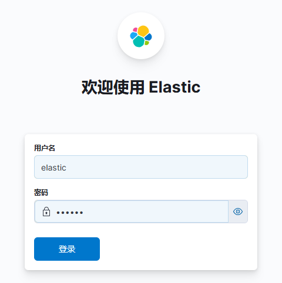

## Docker快速启动es

版本信息

|       服务       |   版本   |
|:--------------:|:------:|
|     Docker     | 26.1.1 |
| docker-compose | 2.33.0 |
|       ES       | 8.15.3 |
|     kibana     | 8.15.3 |

本示例演示ES的**单节点**快速启动，适用于**开发/测试**环境！

### 安装准备

准备[docker-compose.yaml](docker-compose.yaml)，并根据需要调整配置。

> [!NOTE]
> 参照[install_docker.md](../../markdown/install_docker.md)安装docker和docker-compose。

### 提取配置模板

```shell
# 创建宿主机data目录
cd ~
mkdir -p docker/es/data && chmod 775 docker/es/data
# 粘贴yaml配置
vi docker/es/docker-compose.yaml

# 启动（启动前先手动注释yaml中关于2个容器的volume中配置文件映射的部分）
cd docker/es
docker-compose up -d

# 成功启动后，复制容器文件到宿主机
docker cp elasticsearch:/usr/share/elasticsearch/config/elasticsearch.yml ~/docker/es/elasticsearch.yml
docker cp kibana:/usr/share/kibana/config/kibana.yml ~/docker/kibana/kibana.yml

# 重启容器
docker-compose restart

# 如果安装出错，可以一键删除容器和网络
docker-compose down
```

### 设置es密码

在修改前，kibana无法访问es。

```shell
# 在交互式shell输入密码（稍后我们在webui中登录使用）
docker exec -it es bin/elasticsearch-reset-password -u elastic

# 创建kibana链接es的账户（kibana专用，区别于稍后我们在webui中登录使用的账密）
docker exec -it es bin/elasticsearch-reset-password -u kibana
```

小心保存2个密码，并将kibana密码手动添加到kibana.yml中，kibana.yaml如下：

```yaml
#
# ** THIS IS AN AUTO-GENERATED FILE **
#

# Default Kibana configuration for docker target
server.host: "0.0.0.0"
server.shutdownTimeout: "5s"
elasticsearch.hosts: [ "http://es:9200" ]
monitoring.ui.container.elasticsearch.enabled: true

# 新增
elasticsearch.username: "kibana"
elasticsearch.password: "KiSEUqKR=UNY_dj=sY=O" # 替换你的
```

重启kibana容器：

```shell
# 过程可能需要20s完成
docker restart kibana
```

### 访问kibana

kibana的访问端口是`5601`，注意在虚拟机或防火墙中放行。浏览器输入`http://locallhost:5601`，即可访问kibana。



> [!NOTE]
> 若kibana无法链接es（一般是kibana.yaml中配置的密码错误），则这里会显示“Kibana服务器尚未就绪”。

在输入框内添加用户名`elastic`和密码（刚刚重置时由es生成的一串密文，复制即可）。