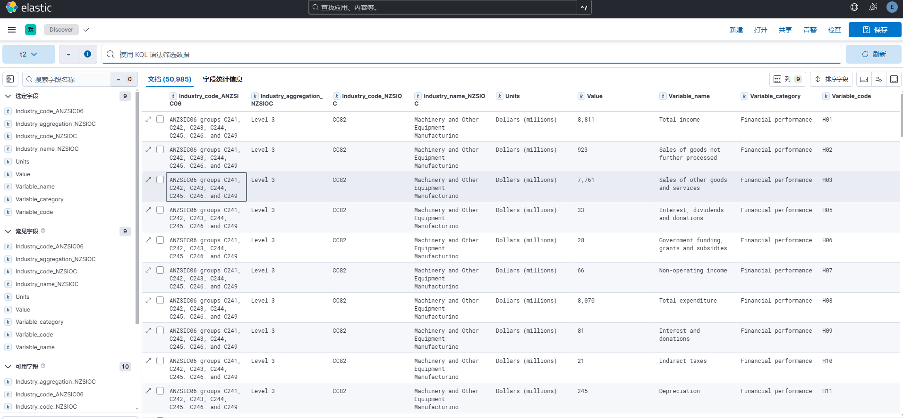
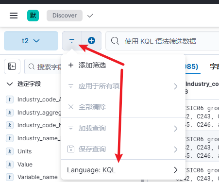

## Kibana 使用

下载 [annual-enterprise-survey-2023-financial-year-provisional.csv](annual-enterprise-survey-2023-financial-year-provisional.csv)，
通过 [添加集成][添加集成] 导入ES，然后在 Discover 页面查看数据。



### 搜索

Kibana UI中的搜索语法的KQL(Kibana Query Language)，还支持 Lucene 语法。下面提供一些示例：

```
# 精确匹配，匹配a列=‘123’的行
a: "123"

# 模糊匹配，匹配a列包含‘123’的行
a: "*123*"

# 前缀匹配，匹配a列包含前缀‘123’的行
a: "123*"

# 针对token的模糊匹配，匹配a列包含‘123’的行
a: *123*

# 针对token的前缀模糊匹配，匹配a列包含‘123’的行
a: 123*

# 多字段搜索（匹配c2这个前缀词，以及包含Total的行）
c2* Total

# 肯定和否定搜索
+c241 -Total

# 转义，搜索特殊字符时需要转义（+ - = && || > < ! ( ) { } [ ] ^ " ~ * ? : \ /）
+\
```

### 使用 Lucene 语法

KQL语法有一些局限，比如不支持 `?` 通配符（匹配单个字符）。而 Lucene 语法则支持。下图演示切换语法：



然后是一些 Lucene 示例：

```
# 模糊匹配，匹配CC8这个前缀词，？代表一个任意字符
CC8?

# 正则查询
暂无
```

### 使用Dev Tools操作es数据

Dev Tools 是 Kibana 的一个工具，可以操作es数据，比如对索引的增删查改等，很常用。

> [!NOTE]
> Dev Tools在Kibana的路径是左上角目录按钮--下滑到Management--开发工具。

API示例如下（以下命令可复制到Dev Tools中执行）：

```shell
### 查看数据(指定t2索引，doc_id=xxx的数据)
GET /t2/_doc/nRVdEpUBJnx8u3CLVXAG?pretty

### 上传数据（操作返回doc_id可用于查询），另外有批量上传数据的接口，不演示
POST /t2/_doc?pretty
{
  "name": "Jane Doe", "age": 30
}

### 全量替换数据
PUT /t2/_doc/TBmqEpUBJnx8u3CLhQaZ?pretty
{
  "name": "Jane Doe222"
}

### 更新数据（更新name字段，同时增加habit字段）
POST /t2/_update/TBmqEpUBJnx8u3CLhQaZ?pretty
{
  "doc": { "name": "Jane Doe2", "habit": "football" }
}

### 删除数据
DELETE /t2/_doc/nRVdEpUBJnx8u3CLVXAG

### GET搜索数据（简单过滤，通过URL，可读性较差）
# 注意，搜索词不加双引号才是模糊匹配
GET /t2/_search?q=C2* total&sort=year:desc&from=0&size=10&timeout=1s
GET /t2/_search?q=title:C2*  # 指定字段
GET /t2/_search?q=title:"c2" # 指定字段的精确匹配
GET /t2/_search?q=year:[2013 TO 2015] # 指定字段的区间查询，闭区间，含边界
GET /t2/_search?q=year:<=2010 # 指定字段的区间查询，左闭右开
GET /t2/_search?q=title:beautiful~1 # 近似查询，1表示最多允许一个字符内的差异

### POST搜索数据（复杂过滤，推荐）
POST /t2/_search # 查全部
{
  "query": {
      "match_all": {}
  }
}

###### match分词（常见）
{
  "query": {
      "match": {"Industry_code_ANZSIC06": "C241 123"}
  }
}

###### and查询（C241 AND 123），仅支持单字段
{
  "query": {
      "match": {
        "Industry_code_ANZSIC06": {"query":"C241 123", "operator": "and"},
      }
  }
}

###### 短语搜索（不分词），slop是近似度，1表示允许一个字符内的差异
{
  "query": {
    "match_phrase": {
      "title":{
        "query": "one love",
        "slop": 1
      }
    }
  }
}

###### term精确查询（适用于数字、日期等结构化数据）
{
   "query":{
      "term":{"zip":"176115"}
   }
}

###### Range查询（常用）
{
   "query":{
      "range":{
         "rating":{
            "gte":3.5
         }
      }
   }
}

###### 分页
{
  "from":10,
  "size":20,
  "sort":[{"year":"asc"}],
  "_source":["title", "year"],   # select 返回字段
  "query":{
    "match_all": {}
  }
}

###### 地理位置查询（适用于查找附近的对象，location是geo字段）
{
   "query":{
      "filtered":{
         "filter":{
            "geo_distance":{
               "distance":"100km",
               "location":[32.052098, 76.649294]
            }
         }
      }
   }
}
```

在任何一个请求中添加以下参数，可以对请求进行分析（类似Explain）：

```json
{
  "profile": "true"
}
```

了解以上API操作后，使用SDK时也会快速上手。

### 关于Geo查询

如果在查询中添加了geo字段，则需要先在索引中添加geo字段，并设置类型为geo_point。

```json
{
  "mappings": {
    "school": {
      "_all": {
        "enabled": true
      },
      "properties": {
        "location": {
          "type": "geo_point"
        }
      }
    }
  }
}
```

[添加集成]: http://localhost:5601/app/integrations/browse

### 参考

- [ES: DSL查询](https://elasticsearch.litebook.cn/docs/query-dsl.html)
- [ES: 映射](https://elasticsearch.litebook.cn/docs/mapping.html)