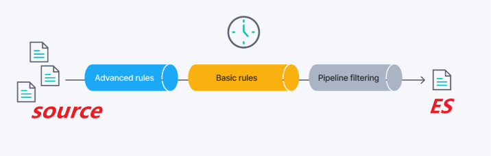

## ES的连接器使用

在Kibana控制台可以创建连接器来同步Mysql数据到ES，使用简单。

## 文档

https://www.elastic.co/guide/en/enterprise-search/8.15/connectors-mysql.html

## 使用注意

- 创建时要指定特定的表，且过滤特定行（如删除的数据）。

## 使用同步规则

分为基本规则和高级规则。高级规则直接在远程（源数据）端过滤数据，高效。基本规则在连接器端过滤数据，低效，用于执行一些复杂的过滤逻辑。
MySQL有特定的高级规则语法。

下面是同步架构，注意高级规则应用于基本规则之前。

## 同步特性

- 对于 MySQL 数据库表中的每一行，连接器都会创建一个 Elasticsearch 文档。
- 对于每一列，连接器将该列转换为 Elasticsearch 字段。
- Elasticsearch 将 MySQL 数据类型动态映射到 Elasticsearch 数据类型。
- 未定义主键的表将被跳过。
- **每次同步都是“完整”同步。**

对于发现的每个 MySQL 行：

- 如果不存在，则在 Elasticsearch 中创建该文档。
- 如果它已经存在于 Elasticsearch 中，则替换 Elasticsearch 文档并增加版本。
- 如果现有的 Elasticsearch 文档不再存在于 MySQL 表中，则将其从 Elasticsearch 中删除。
