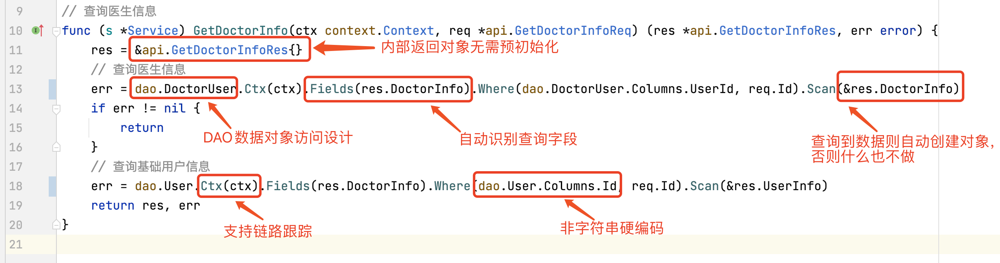

## GoFrame 框架使用

> [!TIP]
> 点击网页右侧的目录按钮查看大纲，支持跳转。

这是一款功能相当大而全的Go基础开发框架，包含web开发以及微服务开发所需的各种组件/工具，基本不需要再去寻找或引入其他单个仓库，
在笔者的工作生涯中遇到过企业使用，所以在此记录。

显著特点：

- 丰富的开发组件
- 简单易用，详细的文档
- 跟踪和错误堆栈功能
- ORM组件
- 工程设计规范
- CLI工具
- OpenTelemetry、OpenAPIV3等。

资料索引：

- Github：https://github.com/gogf/gf
- 快速开始：https://goframe.org/pages/viewpage.action?pageId=57183742

### 基本使用

gf 最新版本 2.7.0 要求Go >= 1.18.0。

```shell
# 安装主库
go get -u -v github.com/gogf/gf/v2

# 安装gf工具
go install github.com/gogf/gf/cmd/gf/v2@latest

# 获取帮助
gf gen -h
```

[工具介绍](https://goframe.org/pages/viewpage.action?pageId=1114260&src=contextnavpagetreemode)：

```shell
gf -v  # 会自动检测当前项目使用的GoFrame版本（解析go.mod）
gf up -cf  # 在升级框架代码库的同时，升级gf工具和修复本地代码在升级中的不兼容变更
gf init webapp # 创建一个项目，使用gf推荐的目录结构
gf init mymono -m # 创建一个微服务大仓

# 代码生成*  v2.5+

```

### 代码结构分层

不管是单服务还是微服务，都是五层架构，api/controller/logic/dao/model。

- api: 请求和响应定义。
- controller：业务接口定义，入参解析验证后传递给service，以及对出参的维护。
    - 可以直接调用dao层实现业务逻辑，当认为逻辑可能会被多个接口复用时，再将逻辑下放到service层。
    - 可以调用一个或多个service方法来得到结果。
- logic（service）：业务逻辑实现，会通过gf工具生成service包。
    - logic层的实现可以调用其他service包来完成逻辑。
    - service包是根据logic层定义的方法生成对应的接口（interface）。
    - 若涉及多表访问（事务），则通过tx传参调用dao层不同方法。
- dao：数据库访问。
    - gf工具为dao层生成一个个以表名命名的go文件（用到的表名在config中配置），开发者在每个文件中定义表相关的dao方法。
    - 方法实现应尽量简洁，让service层来多次调用不同dao方法得到结果，以避免对dao层的频繁修改。
- model：数据库表实体，但也可以是接口需要的其他结构体。
    - 包含`do`和`entity`两个gf工具维护的子目录，其中存放与实际数据表一致的代码结构体。
    - 在model层则存放人工定义的业务需要的模型结构。
    - model层的实体可以在上面几层之间共享（除了api层），而非每一层定义不同的结构体。

请求入口为controller，然后内部再调用logic/dao/model。

### 工程目录设计

gf 规范了工程目录结构。

```shell
/
├── api # 对外提供服务的输入/输出数据结构定义。考虑到版本管理需要，往往以api/xxx/v1...存在。
├── hack # 存放项目开发工具、脚本等内容。例如，CLI工具的配置，各种shell/bat脚本等文件。
├── internal # 业务逻辑存放目录。通过Golang internal特性对外部隐藏可见性。（如api层不能调用internal下面的model包，但反之可以）
│   ├── cmd # 命令行管理目录。可以管理维护多个命令行。
│   ├── consts  # 项目所有常量定义。
│   ├── controller # 接收/解析用户输入参数的入口/接口层。
│   ├── dao
│   |   └── internal # 存放gf工具生成的dao对象，仅允许dao包内调用
│   ├── logic # 业务逻辑封装管理，特定的业务逻辑实现和封装。往往是项目中最复杂的部分。
│   ├── model # 数据结构管理模块，管理 api/dao/service 层所有的出入参数
│   |   ├── do # 自动生成。用于dao数据操作中业务模型与实例模型转换，由工具维护
│   │   └── entity # 自动生成。是模型与数据集合的一对一关系，由工具维护
│   └── service # 用于业务模块解耦的接口定义层。具体的接口实现在logic中进行注入。
├── manifest # 包含程序编译、部署、运行、配置的文件
│   ├── config # 配置文件存放目录。
│   ├── docker # Docker镜像相关依赖文件，脚本文件等等。
│   ├── deploy # 部署相关的文件。默认提供了Kubernetes集群化部署的Yaml模板，通过kustomize管理。
│   └── protobuf # GRPC协议时使用的protobuf协议定义文件，协议文件编译后生成go文件到api目录。
├── resource # 静态资源文件。这些文件往往可以通过 资源打包/镜像编译 的形式注入到发布文件中。
├── utility
├── go.mod
└── main.go # 程序入口文件。
```

问题：api层到底能否引用model内的模型，在 [工程目录设计](https://goframe.org/pages/viewpage.action?pageId=30740166)
页面中存在两处相互矛盾的描述：

- 描述一：“这里的model不仅负责维护数据实体对象（entity）结构定义，也包括所有的输入/输出数据结构定义，被api/dao/service共同引用。”
- 描述二：“注意model中的数据结构不应该直接暴露给外部使用，并且在框架的工程设计中刻意将model目录放到了internal目录下。也不应该在api层中对model中的数据结构进行别名类型定义供外部访问”
    - 在[数据模型与业务模型](https://goframe.org/pages/viewpage.action?pageId=7295964)页面中再次强调了这一点。
    - 即“例如controller, logic, model中均可以调用api层的输入输出模型，但是api层仅用于与外部服务的接口交互，该模型中不能调用或者引用内部的模型如model模型”

#### 请求流转

- cmd：负责引导程序启动，显著的工作是初始化逻辑、注册路由对象、启动server监听、阻塞运行程序直至server退出。
- controller：接收Req请求对象后做一些业务逻辑校验，可以直接在controller中实现业务逻辑，或者调用一个或多个service实现业务逻辑，将执行结果封装为约定的Res数据结构对象返回。
- model：管理了所有的业务模型，service资源的Input/Output输入输出数据结构都由model层来维护。
- service：接口层，用于解耦业务模块，service没有具体的业务逻辑实现，具体的业务实现是依靠logic层注入的。
- logic：业务逻辑实现，需要通过调用dao来实现数据的操作，调用dao时需要传递do数据结构对象，用于传递查询条件、输入数据。dao执行完毕后通过Entity数据模型将数据结果返回给service层。
- dao：通过框架的ORM抽象层组件与底层真实的数据库交互。

#### dao层大改进



其中的`dao.DoctorUser`对象是`gf gen dao`自动生成的表访问对象，工具还会生成具体的表结构体（`model/entity`
），无需人工维护，保障了代码数据结构体与表模型的强一致性。

#### 关于model

model分为两种，一种是**数据模型**，是数据库表中的结构，另一种是**业务模型**，具体又包含**接口输入/输出模型** 与 **业务输入/输出模型
**。

**数据模型**
它由gf自动生成到`internal/model/entity`。

**接口出入模型**

定义在api接口层中，供工程项目所有的层级调用，例如controller, logic,
model中均可以调用api层的输入输出模型。在GoFrame框架规范中，这部分输出输出模型名称以`XxxReq`和`XxxRes`格式命名。

**业务输入/输出模型**

用于服务内部模块/组件之间的方法调用交互，特别是controller->service或者service->service之间的调用。这部分模型定义在model模型层中,
如`internal/model/some_biz.go`，这部分输入输出模型名称通常以`XxxInput`和`XxxOutput`格式命名。

### 微服务大仓管理

当微服务数量少于50个时（符合大部分情况），建议采用单仓库管理所有代码。代码结构设计上也是利用go的**internal特性**
来避免不同服务之间的代码引用，**服务之间仅允许api包的引用**。
参考[微服务大仓管理模式](https://goframe.org/pages/viewpage.action?pageId=87246764)。

### 接口化与泛型设计

GoFrame框架的核心组件均采用了接口化设计，比如gcfg/gcache/gredis/gsession/gdb，它们都是以接口形式提供服务，并且每个方法返回的对象都是一个泛型`gvar.Var`
，可以随意转换为其他类型，对于一些自定义类型，可以通过泛型对象的`Scan`方法转换为具体类型。

### 隐式与显式初始化

GoFrame框架的很多模块都采用了隐式初始化。但对于业务代码，应该避免使用隐式查询，以免无法直观的了解项目的启动顺序。正确示例：

```shell
# main.go

function initBasis() {
  initConf()
  initLogger()
  initDB()
  initRedis()
  initKafka()
  ...
}

initBasis()
startServer()
```

### Context 传递

参考[Context: 业务流程共享变量](https://goframe.org/pages/viewpage.action?pageId=3672552)。

### 开始开发

#### 创建项目

```shell
gf init webapp
cd webapp
```

#### 定义api

在`/api/模块/版本/定义文件.go`中定义具体的请求响应体，例如默认的`HelloReq`和`HelloRes`，
比如按照此范式定义，才能生成控制器代码。

请求/响应体可以通过tag定义字段注释，校验规则。具体参考[数据校验-校验规则](https://goframe.org/pages/viewpage.action?pageId=1114367)。

#### 生成控制器代码

```shell
# -merge是将 hello.go 中的多个 req&res 合并存放到 controller/ 的单个文件中，否则是一个req对应一个文件，不合理。
gf gen ctrl -merge # or `make ctrl`，但make不支持参数输入，只能修改一下makefile
```

生成 `api/hello/hello.go`
的控制器接口代码，以及对应的控制器实现`controller/hello/hello.go| hello_new.go| hello_v1_hello.go`。
**其中的`hello.go`是一个空文件**，用于存放controller内部使用的变量、常量、数据结构定义，或者init方法定义等，官方建议用不到也留着先。。

> [!IMPORTANT]
> 有bug！概率性出现生成的controller代码没有import对应api结构体，需要手动处理。导致报红！v2.7.0

#### 生成dao代码

`gen dao`命令是CLI中最频繁使用的命令。但是这个命令的参数很多，一般通过`hack/config.yml`管理。参考：

```yaml
gfcli:
  gen:
    dao:
      # link定义数据库类型和连接信息
      - link: "mysql:root:123@tcp(127.0.0.1:3306)/test"
        tables: "users" # 指定当前数据库中需要执行代码生成的数据表。如果为空，表示数据库的所有表都会生成!!!
        jsonCase: "CamelLower" # 指定model中生成的数据实体对象中json标签名称规则，还支持 Snake 等
        group: default
        stdTime: true  # 当数据表字段类型为时间类型时，代码生成的属性类型使用标准库的time.Time而不是框架的*gtime.Time类型。
        withTime: true # 为每个自动生成的代码文件增加生成时间注释
        gJsonSupport: true # 当数据表字段类型为JSON类型时，代码生成的属性类型使用*gjson.Json类型。
        importPrefix: "" # 用于指定生成Go文件的import路径前缀
        descriptionTag: false # 用于指定是否为数据模型结构体属性增加desription的标签，内容为对应的数据表字段注释。一般不需要开，因为有注释了。
        typeMapping: # 自定义类型映射，从版本v2.5开始支持。
          decimal:
            type: float64

        #      - link: "mysql:root:12345678@tcp(127.0.0.1:3306)/primary"
        #        path: "./my-app" # 生成dao和model文件的存储目录地址
        #        prefix: "primary_" # 生成的文件名、对象名的前缀
        #        tables: "user, userDetail"
        #        group: order
        #        noJsonTag: true # 生成的数据模型中，字段不带有json标签
        #        noModelComment: true # 不要注释
        #        clear: true # !!!自动删除数据库中不存在对应数据表的本地dao/do/entity代码文件。

      # sqlite需要自行编译带sqlite驱动的gf，下载库代码后修改路径文件（gf\cmd\gf\internal\cmd\cmd_gen_dao.go）的import包，取消注释即可。sqlite驱动依赖了gcc
#      - link: "sqlite:./file.db"
#        group: order
#        tablesEx: "order" # 指定当前数据库中需要排除代码生成的数据表
```

生成路径：

```shell
model/do/users.go  # 不关心
model/entity/users.go # 自动生成的 users表结构体，可以被 controller/logic/dao 层引用

dao/users.go   # 用于crud users表的DAO对象
dao/internal/user.go
```

参考[数据规范-gen dao](https://goframe.org/pages/viewpage.action?pageId=3673173)。

#### 生成service代码

service代码是一层接口抽象，从logic抽象而来。操作顺序是先写logic代码，然后生成service代码，然后controller和其他service可以调用它。

定义logic层方法需要满足范式`logic/xxx/*.go`，即只能有一个二级目录，否则gf无法解析。

步骤：

- 定义`internal/logic/menu/user.go`
    - 可能需要定义每个方法的`*Input`和`*Output`结构体。
- 生成service方法：`gf gen service` 或 `make service`
    - 生成文件：`service/menu.go`
- 在logic代码中编写init函数将方法实现注册到service，参考[logic/menu/user.go](webapp/internal/logic/menu/user.go)
    - 生成的`logic/logic.go`会自动引入`logic/menu`包，确保service接口的注册，而logic包又会被main文件引入。

然后就可以在controller通过service包来调用logic代码了，例如：`service.User().GetUser(ctx, &menu.GetUserInput{})`
，当然，其他service包也可根据需要调用。

参考[数据规范-gen service](https://goframe.org/pages/viewpage.action?pageId=49770772)。

#### 生成enums

gf工具扫描api目录中的请求/响应结构体中使用的全部枚举，然后生成swagger文档所需的go文件，在项目启动后的swagger文档中可以看到字段枚举值。

步骤如下：

- 定义一个api请求&响应，其中包含const枚举，参考[hello.go](webapp/api/hello/v1/hello.go)中的`Hello3Req`；
- 然后执行`gf gen enums` 或 `make enums`，生成`internal/boot/enums.go`；
- 首次生成boot目录时，将其添加到main.go中初始化即可。

然后`gf run main.go`启动项目，访问输出中的swagger地址，在web端可以看到接口`Hello3Req`中的字段PodState列出了枚举值。

#### 生成pb

如果你的项目用不到protobuf，忽略此章节。

识别proto文件，生成对应的pb Go文件。这个功能建议不要用gf提供的`gen pb`
命令，因为它没有集成protoc执行文件，需要自行下载，而这就会产生两者版本的兼容性问题（`gf gen pb`命令执行报错）。

步骤如下：

- 下载protoc文件，并安装插件：protoc-gen-go, protoc-gen-go-grpc；
    - 可直接在[这个页面](https://github.com/chaseSpace/go-microsvc-template/tree/main/tool_win/protoc_v24)下载全部。
- 定义`manifest/protobuf/svc_a/a.proto`文件；
- 使用protoc命令生成代码到指定位置；

protoc命令如下：

```shell
mkdir -p ./api/pb
OUTPUT_DIR=./api/pb
SRC=./manifest/protobuf/
protoc -I ./manifest/protobuf \
      --go_out=$OUTPUT_DIR \
      --go_opt=paths=source_relative \
      $SRC/*/*.proto $SRC/*.proto
```

pb文件中引入了protobuf库，记得拉取：`go get -u google.golang.org/protobuf`
。笔者修改了Makefile文件，用以上命令替换了原来的`gen pb`脚本，参考 [makefile引用的hack.mk](webapp/hack/hack.mk) 中的`pb`部分。

> [!IMPORTANT]
> 当然还剩下一个问题，由于是使用原生protoc命令生成代码，所以控制器的代码需要自己写。

#### 生成pbentity

之前的dao生成只是将数据库中的表模型生成go代码结构体，即`model/entity`
，它主要是给Go程序使用，但在异构服务或前后端使用pb协作的场景中，则需要通过proto文件来共享数据模型。这时候
go代码的entity就没法使用了，所以pbentity就派上用场。

步骤：

- 在`hack/config.yaml`中加入`gfcli.gen.pbentity`配置，其中包含数据库连接信息、生成目标位置等；
    - 确保数据库表存在，能连接。
- 执行：`gf gen pbentity` 或 `make pbentity`，然后可以观察到目标位置`manifest/protobuf/pbentity`包含新的proto文件，其中包含表模型。

#### 运行

```shell
gf run main.go
```

使用**gf**工具启动的好处是会自动监控项目中所有go文件变化，然后进行自动编译重启。同时可以在 `hack/config.yaml`
中加入`gfcli.run`配置，其中可以包含二进制存放位置、go编译参数等。

#### Build

编译Go程序。

- 在`hack/config.yaml`中加入`gfcli.build`配置；
- 执行`gf build` 或 `make build`；

#### 打包镜像

`gf docker`命令默认使用`manifest/docker/Dockerfile`将已经编译好的二进制打包到alpine镜像。相关参数通过 `hack/config.yaml`
中的`gfcli.docker`配置。

`make image`是对该命令的封装，自动上传是`make image.push`。

### 资源管理

这个功能不是常用的，只有在项目运行用到非go静态文件时（比如ip2region文件等）才可能用到，它只是一种将静态文件打包到go执行文件中的方法。

参考[这个页面](https://goframe.org/pages/viewpage.action?pageId=1114671)。

### 日常开发文档索引

查看[核心组件](https://goframe.org/pages/viewpage.action?pageId=1114409)页面。

### 其他工具

GoFrame提供了极其丰富的日常工具使用，包括但不限于数据结构、定时器、锁、上下文、日志管理、时间转换、缓存、类型转换、编码和加密等。

在[这个页面](https://goframe.org/pages/viewpage.action?pageId=1114411)搜索。

### 微服务开发

[这个页面](https://goframe.org/pages/viewpage.action?pageId=77852968)。

### Web开发

Demo项目是一个HTTP服务，在[cmd.go](webapp/internal/cmd/cmd.go)中启动了一个HTTP服务器，其中使用了gf提供的HTTP框架。
由`ghttp`模块实现。实现了丰富完善的相关组件，例如：Router、Cookie、Session、路由注册、配置管理、模板引擎、缓存控制等等，
支持热重启、热更新、多域名、多端口、多实例、HTTPS、Rewrite、PProf等等特性。

参考[Web框架文档](https://goframe.org/pages/viewpage.action?pageId=1114405&src=contextnavpagetreemode)。

### 其他

GoFrame还提供了TCP/UDP、Websocket协议组件、可观测性，根据实际需求探索使用。