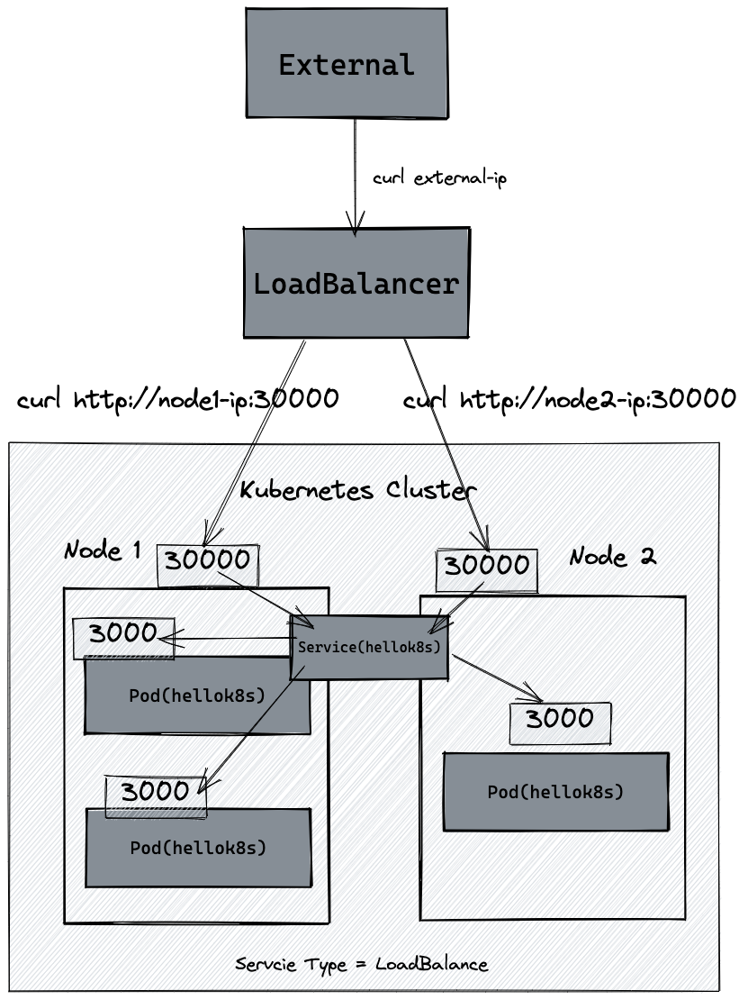

## k8s使用教程

<!-- TOC -->
  * [k8s使用教程](#k8s使用教程)
    * [0. 安装docker](#0-安装docker)
    * [1. 创建程序和使用docker打包镜像](#1-创建程序和使用docker打包镜像)
    * [2. 推送到docker仓库](#2-推送到docker仓库)
    * [3. 了解并创建Pod](#3-了解并创建pod)
      * [3.1 创建nginx pod](#31-创建nginx-pod)
      * [3.2 创建pod](#32-创建pod)
      * [3.3 查看nginx-pod状态](#33-查看nginx-pod状态)
      * [3.4 与pod交互](#34-与pod交互)
      * [3.5 Pod 与 Container 的不同](#35-pod-与-container-的不同)
      * [3.6 创建go程序的pod](#36-创建go程序的pod)
      * [3.7 pod有哪些状态](#37-pod有哪些状态)
    * [4. 使用Deployment](#4-使用deployment)
      * [4.1 部署deployment：](#41-部署deployment)
      * [4.2 修改deployment](#42-修改deployment)
      * [4.3 更新deployment](#43-更新deployment)
      * [4.4 回滚部署](#44-回滚部署)
      * [4.4 滚动更新（Rolling Update）](#44-滚动更新rolling-update)
      * [4.5 deployment的扩缩容](#45-deployment的扩缩容)
      * [4.6 k8s的镜像管理](#46-k8s的镜像管理)
    * [参考资料](#参考资料)
<!-- TOC -->

**环境准备**：

```
10.0.2.2 k8s-master  
10.0.2.3 k8s-node1
```

一些提高效率的设置：

1. 安装oy-my-zsh（以及自动补全插件），[教程](https://jsharkc.github.io/post/centos-install-oh-my-zsh/)
2. 设置kubectl的alias为`kk`，下文会用到。

### 0. 安装docker
[Centos安装docker](https://www.runoob.com/docker/centos-docker-install.html)

```shell
yum install -y yum-utils device-mapper-persistent-data lvm2
yum-config-manager --add-repo http://mirrors.aliyun.com/docker-ce/linux/centos/docker-ce.repo
# 列出可用版本
#yum list docker-ce --showduplicates | sort -r
# 选择版本安装
yum -y install docker-ce-18.03.1.ce

docker version
systemctl enable docker

# 设置源
echo '{
    "registry-mirrors": [
        "http://hub-mirror.c.163.com",
        "https://docker.mirrors.ustc.edu.cn",
        "https://registry.docker-cn.com"
    ]
}' > /etc/docker/daemon.json

systemctl restart docker

# 查看源是否设置成功
docker info |grep Mirrors -A 3
```

### 1. 创建程序和使用docker打包镜像

1. 编写一个简单的[main.go](./minikube/main.go)
2. 编写[Dockerfile](Dockerfile)

打包镜像（替换leigg为你的docker账户名）

```shell
docker build . -t leigg/hellok8s:v1
```

这里有个小问题，（修改代码后）重新构建镜像若使用同样的镜像名会导致旧的镜像的名称和tag变成`<none>`，可通过下面的命令来一键删除：

```shell
docker image prune -f
# docker system prune # 删除
```

测试运行：

```shell
docker run --rm -p 3000:3000 leigg/hellok8s:v1
```

### 2. 推送到docker仓库

先登录

```shell
$ docker login  # 然后输入自己的docker账户和密码，没有先去官网注册
```

推送

```shell
docker push leigg/hellok8s:v1
```

### 3. 了解并创建Pod

Pod 是 Kubernetes 最小的可部署单元，**通常包含一个或多个容器**。
它们可以容纳紧密耦合的容器，例如运行在同一主机上的应用程序和其辅助进程。但是，在生产环境中，通常使用其他资源来更好地管理和扩展服务。

Pod是 Kubernetes 中创建和管理的、最小的可部署的计算单元。

#### 3.1 创建nginx pod

```yaml
# nginx.yaml
apiVersion: v1
kind: Pod  # 资源类型=pod
metadata:
  name: nginx-pod  # 需要唯一
spec:
  containers: # pod内的容器组
    - name: nginx-container
      image: nginx  # 镜像默认来源 DockerHub
```

#### 3.2 创建pod

运行第一条k8s命令创建pod：

```shell
kubectl apply -f nginx.yaml
```

#### 3.3 查看nginx-pod状态

```shell
kubectl get po nginx-pod
```

查看全部pods：`kubectl get pods`

#### 3.4 与pod交互

添加端口转发，然后就可以在宿主机访问nginx-pod

```shell
# 宿主机4000映射到pod的80端口
# 这条命令是阻塞的，仅用来调试pod服务是否正常运行
kubectl port-forward nginx-pod 4000:80

# 打开另一个控制台
curl http://127.0.0.1:4000
```

其他命令：

```shell
kubectl delete pod nginx-pod # 删除pod
kubectl delete -f nginx.yaml  # 删除配置文件内的全部资源
 
kubectl exec -it nginx-pod -- /bin/bash   # 进入pod shell

# 支持 --tail LINES_NUM
kubectl logs -f nginx-pod  # 查看日志（stdout/stderr）
```

#### 3.5 Pod 与 Container 的不同

在刚刚创建的资源里，在最内层是我们的服务 nginx，运行在 container 容器当中， container (容器) 的**本质是进程**，而 pod 是管理这一组进程的资源。

所以 pod 可以管理多个 container，在某些场景例如服务之间需要文件交换(日志收集)，本地网络通信需求(使用 localhost 或者 Socket 文件进行本地通信)，
在这些场景中使用 pod 管理多个 container 就非常的推荐。而这，也是 k8s 如何处理服务之间复杂关系的第一个例子。

**Pod定义**  
Pod 是 Kubernetes 最小的可部署单元，通常包含一个或多个容器。它们可以容纳紧密耦合的容器，例如运行在同一主机上的应用程序和其辅助进程。但是，在生产环境中，通常使用其他资源来更好地管理和扩展服务。

#### 3.6 创建go程序的pod

定义[pod.yaml](./pod.yaml)

启动pod：

```shell
$ kk apply -f pod.yaml
# 几秒后
$ kk get pods
NAME      READY   STATUS    RESTARTS   AGE
go-http   1/1     Running   0          17s
```

临时开启端口转发（在master节点）：

```shell
# 绑定pod端口3000到 master节点的3000端口
kubectl port-forward go-http 3000:3000
```
现在pod提供的http服务可以在master节点上可用。

打开另一个会话测试：
```shell
$ curl http://localhost:3000
[v1] Hello, Kubernetes!#
```

#### 3.7 pod有哪些状态

- Pending（挂起）： Pod 正在等待调度。
- ContainerCreating（容器创建中）： Pod 已经被调度，但其中的容器尚未完全创建和启动。
- Running（运行中）： Pod 中的容器已经在运行。
- Succeeded（已成功）： 所有容器都成功终止，任务或工作完成，特指那些批处理任务而不是常驻容器。
- Failed（已失败）： 至少一个容器以非零退出码终止。
- Unknown（未知）： 无法获取 Pod 的状态。

### 4. 使用Deployment
通常，Pod不会被（通过pod.yaml）直接创建和管理，而是由更高级别的控制器，如Deployment，来创建和管理。
这是因为Deployment提供了更强大的应用程序管理功能。

- **应用管理**：Deployment是Kubernetes中的一个控制器，用于管理应用程序的部署和更新。它允许你定义应用程序的期望状态，然后确保集群中的副本数符合这个状态。

- **自愈能力**：Deployment可以自动修复故障，如果Pod失败，它将启动新的Pod来替代。这有助于确保应用程序的高可用性。

- **滚动更新**：Deployment支持滚动更新，允许你逐步将新版本的应用程序部署到集群中，而不会导致中断。

- **副本管理**：Deployment负责管理Pod的副本，可以指定应用程序需要的副本数量，Deployment将根据需求来自动调整。

- **声明性配置**：Deployment的配置是声明性的，你只需定义所需的状态，而不是详细指定如何实现它。Kubernetes会根据你的声明来管理应用程序的状态。

先创建一个[deployment文件](./deployment.yaml)， 用来编排多个pod。

#### 4.1 部署deployment：
```shell
$ kk apply -f deployment.yaml
deployment.apps/hellok8s-go-http created

# 查看启动的pod
$ kk get deployments                
NAME               READY   UP-TO-DATE   AVAILABLE   AGE
hellok8s-go-http   2/2     2            2           3m
```
还可以查看pod运行的node：
```shell
# 这里的IP是pod ip，属于部署k8s集群时规划的pod网段
# NODE就是集群中的node名称
$ kk get pod -o wide
NAME                                READY   STATUS    RESTARTS   AGE   IP           NODE        NOMINATED NODE   READINESS GATES
hellok8s-go-http-55cfd74847-5jw7f   1/1     Running   0          68s   20.2.36.75   k8s-node1   <none>           <none>
hellok8s-go-http-55cfd74847-zlf49   1/1     Running   0          68s   20.2.36.74   k8s-node1   <none>           <none>
```

**删除pod会自动重启一个，确保可用的pod数量与`replicas`保持一致，不再演示**。

#### 4.2 修改deployment
通过vi修改内容中的replicas=3，再次部署，开始之前，我们使用下面的命令来观察pod数量变化
```shell
$ kubectl get pods --watch
NAME                                   READY   STATUS    RESTARTS   AGE
hellok8s-go-http-58cb496c84-cft9j   1/1     Running   0          4m7s


# 在另一个CLI执行 kk apply ...

hellok8s-go-http-58cb496c84-sdrt2   0/1     Pending   0          0s
hellok8s-go-http-58cb496c84-sdrt2   0/1     Pending   0          0s
hellok8s-go-http-58cb496c84-pjkp9   0/1     Pending   0          0s
hellok8s-go-http-58cb496c84-pjkp9   0/1     Pending   0          0s
hellok8s-go-http-58cb496c84-sdrt2   0/1     ContainerCreating   0          0s
hellok8s-go-http-58cb496c84-pjkp9   0/1     ContainerCreating   0          0s
hellok8s-go-http-58cb496c84-pjkp9   1/1     Running             0          1s
hellok8s-go-http-58cb496c84-sdrt2   1/1     Running             0          1s
```

#### 4.3 更新deployment
这一步通过修改main.go来模拟实际项目中的服务更新，修改后的文件是[main2.go](./main2.go)。

重新构建镜像：
```shell
docker build . -t leigg/hellok8s:v2
```

再次push镜像到仓库：
```shell
docker push leigg/hellok8s:v2
```
然后更新deployment：
```shell
$ kubectl set image deployment/hellok8s-go-http hellok8s=leigg/hellok8s:v2

$ 查看更新过程
$ kubectl rollout status deployment/hellok8s-go-http
Waiting for deployment "hellok8s-go-http" rollout to finish: 2 out of 3 new replicas have been updated...
Waiting for deployment "hellok8s-go-http" rollout to finish: 2 out of 3 new replicas have been updated...
Waiting for deployment "hellok8s-go-http" rollout to finish: 2 out of 3 new replicas have been updated...
Waiting for deployment "hellok8s-go-http" rollout to finish: 1 old replicas are pending termination...
Waiting for deployment "hellok8s-go-http" rollout to finish: 1 old replicas are pending termination...
deployment "hellok8s-go-http" successfully rolled  # OK

# 也可以直接查看pod信息，会观察到pod正在更新（这是一个启动新pod，删除旧pod的过程，最终会维持到所配置的replicas数量）
$ kk get pods
NAMESPACE     NAME                                       READY   STATUS              RESTARTS      AGE
default       go-http                                    1/1     Running             0             14m
default       hellok8s-go-http-55cfd74847-5jw7f          1/1     Terminating         0             27m
default       hellok8s-go-http-55cfd74847-z29dl          1/1     Running             0             23m
default       hellok8s-go-http-55cfd74847-zlf49          1/1     Running             0             27m
default       hellok8s-go-http-668c7f75bd-m56pm          0/1     ContainerCreating   0             0s
default       hellok8s-go-http-668c7f75bd-qlrk5          1/1     Running             0             14s

# 绑定其中一个pod来测试
$ kk port-forward hellok8s-go-http-668c7f75bd-m56pm 3000:3000
Forwarding from 127.0.0.1:3000 -> 3000
Forwarding from [::1]:3000 -> 3000
```
在另一个会话窗口执行
```shell
$ curl http://localhost:3000
[v2] Hello, Kubernetes!
```

这里演示的更新是容器更新，修改deployment.yaml的其他配置也属于更新。

#### 4.4 回滚部署
如果新的镜像无法正常启动，则旧的pod不会被删除，但需要回滚，使deployment回到正常状态。

按照下面的步骤进行：

1. 修改main.go，将最后监听端口那行先注释，添加一行：panic("something went wrong")
2. 构建镜像: docker build . -t leigg/hellok8s:v2_problem
3. push镜像：docker push leigg/hellok8s:v2_problem
4. 更新deployment使用的镜像：kubectl set image deployment/hellok8s-go-http hellok8s=leigg/hellok8s:v2_problem
5. 观察：kubectl rollout status deployment/hellok8s-go-http   （会停滞，按 Ctrl-C 停止观察）
6. 观察pod：kubectl get pods

```shell
$ kk get pods
NAME                                READY   STATUS             RESTARTS     AGE
go-http                             1/1     Running            0            36m
hellok8s-go-http-55cfd74847-fv2kp   1/1     Running            0            17m
hellok8s-go-http-55cfd74847-l78pb   1/1     Running            0            17m
hellok8s-go-http-55cfd74847-qtb59   1/1     Running            0            17m
hellok8s-go-http-7c9d684dd-msj2c    0/1     CrashLoopBackOff   1 (4s ago)   6s

# CrashLoopBackOff状态表示重启次数过多，过一会儿再试，这表示pod内的容器无法正常启动，或者启动就立即退出了

# 查看每个副本集每次更新的pod情况（包含副本数量、上线时间、使用的镜像tag）
# DESIRED-预期数量，CURRENT-当前数量，READY-可用数量
# -l 进行标签筛选
$ kubectl get rs -l app=hellok8s -o wide
NAME                          DESIRED   CURRENT   READY   AGE   CONTAINERS   IMAGES                      SELECTOR
hellok8s-go-http-55cfd74847   0         0         0       76s   hellok8s     leigg/hellok8s:v1           app=hellok8s,pod-template-hash=55cfd74847
hellok8s-go-http-668c7f75bd   3         3         3       55s   hellok8s     leigg/hellok8s:v2           app=hellok8s,pod-template-hash=668c7f75bd
hellok8s-go-http-7c9d684dd    1         1         0       11s   hellok8s     leigg/hellok8s:v2_problem   app=hellok8s,pod-template-hash=7c9d684dd
```

现在进行回滚：
```shell
# 先查看deployment更新记录
$ kk rollout history deployment/hellok8s-go-http               
deployment.apps/hellok8s-go-http 
REVISION  CHANGE-CAUSE
1         <none>
2         <none>
3         <none>

# 现在回到revision 2，可以先查看它具体信息（主要看用的哪个镜像tag）
$ kk rollout history deployment/hellok8s-go-http --revision=2
deployment.apps/hellok8s-go-http with revision #2
Pod Template:
  Labels:	app=hellok8s
	pod-template-hash=668c7f75bd
  Containers:
   hellok8s:
    Image:	leigg/hellok8s:v2
    Port:	<none>
    Host Port:	<none>
    Environment:	<none>
    Mounts:	<none>
  Volumes:	<none>

# 确认后，回滚（到上个版本）
$ kubectl rollout undo deployment/hellok8s-go-http  #到指定版本 --to-revision=2          
deployment.apps/hellok8s-go-http rolled back

# 检查副本集状态（所处的版本）
$ kk get rs -l app=hellok8s -o wide                                
hellok8s-go-http-55cfd74847   0         0         0       9m31s   hellok8s     leigg/hellok8s:v1           app=hellok8s,pod-template-hash=55cfd74847
hellok8s-go-http-668c7f75bd   3         3         3       9m10s   hellok8s     leigg/hellok8s:v2           app=hellok8s,pod-template-hash=668c7f75bd
hellok8s-go-http-7c9d684dd    0         0         0       8m26s   hellok8s     leigg/hellok8s:v2_problem   app=hellok8s,pod-template-hash=7c9d684dd

# 恢复正常
$ kk get deployments hellok8s-go-http
NAME               READY   UP-TO-DATE   AVAILABLE   AGE
hellok8s-go-http   3/3     3            3           7m42s
```

#### 4.5 滚动更新（Rolling Update）
k8s 1.15版本起支持滚动更新，即先创建新的pod，创建成功后再删除旧的pod，确保更新过程无感知，大大降低对业务影响。

在 deployment 的资源定义中, spec.strategy.type 有两种选择:

- RollingUpdate: 逐渐增加新版本的 pod，逐渐减少旧版本的 pod。（常用）
- Recreate: 在新版本的 pod 增加前，先将所有旧版本 pod 删除（针对那些不能多进程部署的服务）

另外，还可以通过以下字段来控制升级 pod 的速率：
- maxSurge: 最大峰值，用来指定可以创建的超出期望 Pod 个数的 Pod 数量。
- maxUnavailable: 最大不可用，用来指定更新过程中不可用的 Pod 的个数上限。

如果不设置，deployment会有默认的配置：
```shell
$ kk describe -f deployment.yaml
Name:                   hellok8s-go-http
Namespace:              default
CreationTimestamp:      Sun, 13 Aug 2023 21:09:33 +0800
Labels:                 <none>
Annotations:            deployment.kubernetes.io/revision: 1
Selector:               app=aaa,app1=hellok8s
Replicas:               3 desired | 3 updated | 3 total | 3 available | 0 unavailable
StrategyType:           RollingUpdate
MinReadySeconds:        0
RollingUpdateStrategy:  25% max unavailable, 25% max surge # <------ 看这
省略。。。
```

为了明确地指定deployment的更新方式，我们需要在yaml中配置：
```shell
apiVersion: apps/v1
kind: Deployment
metadata:
  name: hellok8s-go-http
spec:
  strategy:
    rollingUpdate:
      maxSurge: 1
      maxUnavailable: 1
  replicas: 3
省略其他熟悉的配置项。。。
```
这样，我们通过`k apply`命令时会以滚动更新方式进行。
>从`maxSurge: 1`可以看出更新时最多会出现4个pod，从`maxUnavailable: 1`可以看出最少会有2个pod正常运行。

注意：无论是通过`kubectl set image ...`还是`kubectl rollout restart deployment xxx`方式更新deployment都会遵循配置进行滚动更新。

#### 4.6 deployment的扩缩容
```shell
# 指定副本数量
$ kubectl scale deployment/hellok8s-go-http --replicas=10
deployment.apps/hellok8s-go-http scaled

# 观察到副本集版本并没有变化，而是数量发生变化
$ kubectl get rs -l app=hellok8s -o wide                 
NAME                          DESIRED   CURRENT   READY   AGE   CONTAINERS   IMAGES                      SELECTOR
hellok8s-go-http-55cfd74847   0         0         0       33m   hellok8s     leigg/hellok8s:v1           app=hellok8s,pod-template-hash=55cfd74847
hellok8s-go-http-668c7f75bd   10        10        10      33m   hellok8s     leigg/hellok8s:v2           app=hellok8s,pod-template-hash=668c7f75bd
hellok8s-go-http-7c9d684dd    0         0         0       32m   hellok8s     leigg/hellok8s:v2_problem   app=hellok8s,pod-template-hash=7c9d684dd
```

#### 4.7 存活探针 (livenessProb)
存活探测器来确定什么时候要重启容器。 例如，存活探测器可以探测到应用死锁（应用程序在运行，但是无法继续执行后面的步骤）情况。 重启这种状态下的容器有助于提高应用的可用性，即使其中存在缺陷。

下面更新app代码为[main_liveness.go](./main_liveness.go)，并且构建新的镜像以及推送到远程仓库：
```shell
docker build . -t leigg/hellok8s:liveness
docker push leigg/hellok8s:liveness
```

然后在deployment.yaml内添加存活探针配置：
```shell
apiVersion: apps/v1
kind: Deployment
metadata:
  # deployment唯一名称
  name: hellok8s-go-http
spec:
  replicas: 2 # 副本数量
  selector:
    matchLabels:
      app: hellok8s # 管理template下所有 app=hellok8s的pod，（要求和template.metadata.labels完全一致！！！否则无法部署deployment）
  template: # template 定义一组pod
    metadata:
      labels:
        app: hellok8s
    spec:
      containers:
        - image: leigg/hellok8s:v1
          name: hellok8s
          # 存活探针
          livenessProbe:
            # http get 探测指定pod提供HTTP服务的路径和端口
            httpGet:
              path: /healthz
              port: 3000
            # 3s后开始探测
            initialDelaySeconds: 3
            # 每3s探测一次
            periodSeconds: 3
```
更新deployment：
```shell
kk apply -f deployment.yaml
kk set image deployment/hellok8s-go-http hellok8s=leigg/hellok8s:liveness
```

现在pod将在15s后一直重启：
```shell
$ kk get pods
NAME                                READY   STATUS    RESTARTS      AGE
hellok8s-go-http-7d948dfc79-jwjrm   1/1     Running   2 (10s ago)   58s
hellok8s-go-http-7d948dfc79-wpk2d   1/1     Running   2 (11s ago)   59s


#可以看到探针失败原因
$ kk describe pod hellok8s-go-http-7d948dfc79-wpk2d
...
Events:
  Type     Reason     Age                 From               Message
  ----     ------     ----                ----               -------
  Normal   Scheduled  113s                default-scheduler  Successfully assigned default/hellok8s-go-http-7d948dfc79-wpk2d to k8s-node1
  Normal   Pulled     41s (x4 over 113s)  kubelet            Container image "leigg/hellok8s:liveness" already present on machine
  Normal   Created    41s (x4 over 113s)  kubelet            Created container hellok8s
  Normal   Started    41s (x4 over 113s)  kubelet            Started container hellok8s
  Normal   Killing    41s (x3 over 89s)   kubelet            Container hellok8s failed liveness probe, will be restarted
  Warning  Unhealthy  23s (x10 over 95s)  kubelet            Liveness probe failed: HTTP probe failed with statuscode: 500
```

还有其他探测方式，比如TCP、gRPC、Shell命令。

[官方文档](https://kubernetes.io/docs/tasks/configure-pod-container/configure-liveness-readiness-startup-probes/)


### 4.8 就绪探针 (readiness)
就绪探测器可以知道容器何时准备好接受请求流量，当一个 Pod 内的所有容器都就绪时，才能认为该 Pod 就绪。 
这种信号的一个用途就是控制哪个 Pod 作为 Service 的后端。若 Pod 尚未就绪，会被从 Service 的负载均衡器中剔除。

如果一个Pod升级后不能就绪，就不应该允许流量进入该Pod，否则升级完成后导致所有服务不可用。

下面更新app代码为[main_readiness.go](./main_readiness.go)，并且构建新的镜像以及推送到远程仓库：
```shell
docker build . -t leigg/hellok8s:readiness
docker push leigg/hellok8s:readiness
```
然后修改配置文件为 [deployment_readiness.yaml](deployment_readiness.yaml) 

更新deployment：
```shell
kk apply -f deployment.yaml
kk set image deployment/hellok8s-go-http hellok8s=leigg/hellok8s:readiness
```
现在可以发现两个 pod 一直处于没有 Ready 的状态当中，通过 describe 命令可以看到是因为 `Readiness probe failed: HTTP probe failed with statuscode: 500 `的原因。
又因为设置了最大不可用的服务数量为maxUnavailable=1，这样能保证剩下两个 v2 版本的 hellok8s 能继续提供服务。

```shell
$ kk get pods                                                       
NAME                                READY   STATUS    RESTARTS   AGE
hellok8s-go-http-764849969-9rtdw    1/1     Running   0          10m
hellok8s-go-http-764849969-qfqds    1/1     Running   0          10m
hellok8s-go-http-7b778ccdcd-c9kv4   0/1     Running   0          5s
hellok8s-go-http-7b778ccdcd-fn7p6   0/1     Running   0          5s

$ kk describe pod hellok8s-go-http-7b778ccdcd-c9kv4
...
Events:
  Type     Reason     Age                  From               Message
  ----     ------     ----                 ----               -------
  Normal   Scheduled  112s                 default-scheduler  Successfully assigned default/hellok8s-go-http-7b778ccdcd-c9kv4 to k8s-node1
  Normal   Pulled     111s                 kubelet            Container image "leigg/hellok8s:readiness" already present on machine
  Normal   Created    111s                 kubelet            Created container hellok8s
  Normal   Started    111s                 kubelet            Started container hellok8s
  Warning  Unhealthy  21s (x22 over 110s)  kubelet            Readiness probe failed: HTTP probe failed with statuscode: 500
```

### 5. 使用Service

先提出几个问题：
- 在前面的内容中，我们通过`port-forward`的临时方式来访问pod，需要指定某个pod名称，而如果pod发生扩容或重启，pod名称就会变化，
那如何获取稳定的pod访问地址呢？
- deployment通常会包含多个pod，如何进行负载均衡？

`Service` 就是用来解决上述问题的。

kubernetes 提供了一种名叫 `Service` 的资源帮助解决这些问题，它为 pod 提供一个稳定的 Endpoint。`Service` 位于 pod 的前面，
负责接收请求并将它们传递给它后面的所有pod。一旦服务中的 Pod 集合发生更改，Endpoints 就会被更新，请求的重定向自然也会导向最新的 pod。

> `Service`为Pod提供了网络访问、负载均衡以及服务发现等功能。

#### 5.1 不同类型的Service
Kubernetes提供了多种类型的Service，包括ClusterIP、NodePort、LoadBalancer和ExternalName，每种类型服务不同的需求和用例。
Service类型的选择取决于你的应用程序的具体要求以及你希望如何将其暴露到网络中。

- ClusterIP: 
  - 用途：如果你的服务只需要在集群内部访问，而不需要从集群外部直接访问，可以使用ClusterIP。
  - 示例：内部数据库服务、内部API服务等。
- NodePort:
  - 用途：通过每个节点上的 IP 和静态端口（NodePort）公开 Service。 为了让 Service 可通过节点端口访问，Kubernetes 会为 Service 配置集群 IP 地址， 相当于你请求了`ClusterIP`类型的服务。
  - 示例：Web应用程序、REST API等。
- LoadBalancer:
  - 用途：使用云平台的负载均衡器向外部公开 Service。Kubernetes 不直接提供负载均衡组件； 你必须提供一个，或者将你的 Kubernetes 集群与某个云平台集成。
  - 示例：Web应用程序、公开的API服务等。
- ExternalName:
  - 用途：将服务映射到 externalName 字段（例如，映射到主机名 `api.foo.bar.example`）。 该映射将集群的 DNS 服务器配置为返回具有该外部主机名值的 CNAME 记录。 集群不会为之创建任何类型代理。
  - 示例：连接到外部数据库服务、外部认证服务等。

#### 5.2 Service类型之ClusterIP
ClusterIP通过分配集群内部IP来暴露服务，这样就可以通过集群IP+端口访问到pod服务。

准备工作：

1. 修改main.go为 [main_hostname.go](main_hostname.go)
2. 重新构建和推送镜像
```shell
docker build . -t leigg/hellok8s:v3_hostname
docker push leigg/hellok8s:v3_hostname
```
3. 更新deployment使用的image
```shell
kk set image deployment/hellok8s-go-http hellok8s=leigg/hellok8s:v3_hostname

# 等待pod更新
kk get pods --watch
```
4. deployment更新成功后，编写 `Service` 配置文件 [service-clusterip.yaml](service-clusterip.yaml)
5. 应用`Service` 配置文件，并观察 `Endpoint`
```shell
kk apply -f service-clusterip.yaml

kk get endpoints                  
NAME                         ENDPOINTS                         AGE
kubernetes                   10.0.2.2:6443                     6h54m
service-hellok8s-clusterip   20.2.36.72:3000,20.2.36.73:3000   6m38s
```
可以看到这里第二行是我们刚定义的service，`ENDPOINTS`中包含的两个地址则是两个就绪的pod的访问地址（这个IP也是pod专属网段，节点无法直接访问），
这些端点是和就绪的pod保持实时一致的，下面通过扩缩容来观察。

```shell
$ kk scale deployment/hellok8s-go-http --replicas=3                      
deployment.apps/hellok8s-go-http scaled

$ kk get endpoints                                      
NAME                         ENDPOINTS                                         AGE
kubernetes                   10.0.2.2:6443                                     7h3m
service-hellok8s-clusterip   20.2.36.72:3000,20.2.36.73:3000,20.2.36.74:3000   15m

$ kk scale deployment/hellok8s-go-http --replicas=2
deployment.apps/hellok8s-go-http scaled

# 注意pod ip可能发生变化
$ kk get endpoints                                      
NAME                         ENDPOINTS                         AGE
kubernetes                   10.0.2.2:6443                     7h5m
service-hellok8s-clusterip   20.2.36.72:3000,20.2.36.75:3000   17m
```

查看 Service 提供的在集群内访问pod的虚拟ClusterIP（重要！！！）：
```shell
$ kk get svc service-hellok8s-clusterip     
NAME                         TYPE        CLUSTER-IP     EXTERNAL-IP   PORT(S)    AGE
service-hellok8s-clusterip   ClusterIP   20.1.160.186   <none>        3000/TCP   31m
```

`ClusterIP`类型的`Service`只能在集群内（运行的Pod内）访问，所以在集群节点上也是无法**直接访问**的。
下面启动一个Nginx Pod来访问这个虚拟ClusterIP （`20.1.160.186`）。
1. 定义 [pod_nginx.yaml](pod_nginx.yaml)，并应用它，不再演示。(提前在node上拉取镜像：`ctr images pull docker.io/library/nginx:latest`)
2. 进入nginx pod shell，尝试访问 `service-hellok8s-clusterip`提供的endpoint
```shell
$ kk get pods --watch
NAME                                READY   STATUS    RESTARTS   AGE
hellok8s-go-http-6bb87f8cb5-dstff   1/1     Running   0          27m
hellok8s-go-http-6bb87f8cb5-wtdht   1/1     Running   0          11m
nginx                               1/1     Running   0          11s

# 进入 nginx pod
$ kk exec -it nginx -- bash 
kubectl exec [POD] [COMMAND] is DEPRECATED and will be removed in a future version. Use kubectl exec [POD] -- [COMMAND] instead.

# 访问 hellok8s 提供的 cluster ip
root@nginx:/# curl 20.1.160.186:3000
[v3] Hello, Kubernetes!, From host: hellok8s-go-http-6bb87f8cb5-dstff
# 再访问，可以看到hostname发生变化，这个hostname就是pod的名称（说明service提供了负载均衡）
root@nginx:/# curl 20.1.160.186:3000
[v3] Hello, Kubernetes!, From host: hellok8s-go-http-6bb87f8cb5-wtdht
```

#### 5.2 Service类型之NodePort
`ClusterIP`只能在集群内访问Pod服务，而`NodePort`则进一步将服务暴露到集群外部的节点的固定端口上。

比如K8s集群有2个节点：node1,  node2，暴露后就可以通过 `node1-ip:port` 或 `node2-ip:port` 的方式来稳定访问Pod服务。 

准备工作：
1. 停掉已经创建的`ClusterIP`Service，虽然也不干扰，但可以让演示环境更简单（执行：`kk delete -f service-clusterip.yaml`）；
2. 定义 [service-nodeport.yaml](service-nodeport.yaml)，并应用；
3. 现在可以通过访问k8s集群中的任一节点ip+端口进行验证
```shell
# 同样会分配一个 cluster-ip
$ kk get svc service-hellok8s-nodeport                   
NAME                        TYPE        CLUSTER-IP     EXTERNAL-IP   PORT(S)          AGE
service-hellok8s-nodeport   NodePort    20.1.252.217   <none>        3000:30000/TCP   79s

# 在节点10.0.2.2 上访问 本机端口 以及 节点 10.0.2.3:30000
# - 同样每个ip访问2次验证负载均衡功能
$ curl 10.0.2.2:30000
[v3] Hello, Kubernetes!, From host: hellok8s-go-http-6bb87f8cb5-hx7pv
$ curl 10.0.2.2:30000
[v3] Hello, Kubernetes!, From host: hellok8s-go-http-6bb87f8cb5-4bddw

$ curl 10.0.2.3:30000
[v3] Hello, Kubernetes!, From host: hellok8s-go-http-6bb87f8cb5-hx7pv
$ curl 10.0.2.3:30000
[v3] Hello, Kubernetes!, From host: hellok8s-go-http-6bb87f8cb5-4bddw
```

#### 5.3 Service类型之LoadBalancer
LoadBalancer 是使用云提供商的负载均衡器向外部暴露服务。 外部负载均衡器可以将流量路由到自动创建的 NodePort 服务和 ClusterIP 服务上，
假如你在 AWS 的 EKS 集群上创建一个 Type 为 LoadBalancer 的 Service。它会自动创建一个 ELB (Elastic Load Balancer) ，并可以根据配置的 IP 池中自动分配一个独立的 IP 地址，可以供外部访问。

这一步不再演示，LoadBalancer架构图如下

<div align="center">

</div>

#### 5.4 Service类型之ExternalName

`ExternalName`是k8s中一个特殊的service类型，它不需要指定selector去选择哪些pods实例提供服务，而是使用DNS CNAME机制把自己CNAME到你指定的另外一个域名上，你可以提供集群内的名字，
比如`mysql.db.svc`这样的建立在db命名空间内的mysql服务，也可以指定`http://mysql.example.com`这样的外部真实域名。

比如可以定义一个 `Service` 指向 `ifconfig.me` （一个curl访问可获取自己公网IP的公共地址），然后可以在集群内的任何一个pod上访问这个service的名称，
请求将自动转发到`ifconfig.me`。

>注意`ExternalName`这个类型也仅在集群内生效，在节点上是无法访问service名称的。

准备工作：
1. 定义 [service-externalname.yaml](service-externalname.yaml)，并应用
2. 定义 [pod_busybox.yaml](pod_busybox.yaml) 并应用，用来作为client访问定义好的service
2. 验证步骤如下：
```shell
# 进入busybox pod
$ kk exec -it busybox -- sh            

# 使用 service名称 作为dns地址 进行查找
/ $ nslookup cloud-mysql-svc
Server:		20.1.0.10
Address:	20.1.0.10:53

** server can't find cloud-mysql-svc.cluster.local: NXDOMAIN

** server can't find cloud-mysql-svc.svc.cluster.local: NXDOMAIN

** server can't find cloud-mysql-svc.cluster.local: NXDOMAIN

** server can't find cloud-mysql-svc.svc.cluster.local: NXDOMAIN

cloud-mysql-svc.default.svc.cluster.local	canonical name = mysql-s23423.db.tencent.com

cloud-mysql-svc.default.svc.cluster.local	canonical name = mysql-s23423.db.tencent.com

# 如结果所示，最终在 default.svc.cluster.local 这个域内找到了service配置的外部地址

# 也可使用完整域名查找
/ $ nslookup cloud-mysql-svc.default.svc.cluster.local
Server:		20.1.0.10
Address:	20.1.0.10:53

cloud-mysql-svc.default.svc.cluster.local	canonical name = mysql-s23423.db.tencent.com

cloud-mysql-svc.default.svc.cluster.local	canonical name = mysql-s23423.db.tencent.com
```

**用途说明**：`ExternalName`类Service一般用在集群内部需要调用外部服务的时候，比如云服务商部署的DB等服务。

> 注意：观察`cloud-mysql-svc.default.svc.cluster.local`这个域名组成：
> - `cloud-mysql-svc` 是服务名
> - `default` 是集群 namespace
> - `svc.cluster.local` 是service默认域  
> 也就是说，修改集群 namespace 字段我们就可以实现跨集群 namespace 的Pod访问。

>另外，很多时候，比如是自己部署的DB服务，只有IP而没有域名，ExternalName是无法实现这个需求的，需要使用 `无头Service`+`Endpoints` 来实现，请看后续。
> 
> 
### 参考资料

- [主要参考K8s教程](https://github.com/guangzhengli/k8s-tutorials/blob/main/docs/pre.md)
- [Docker教程](https://yeasy.gitbook.io/docker_practice/)
- [kubectl全部命令-官方](https://kubernetes.io/docs/reference/kubectl/cheatsheet/)
- [国内Centos机器安装clash代理](../../pure_doc/use_clash_linux.md)
