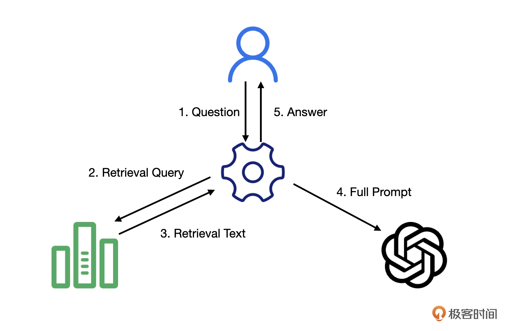
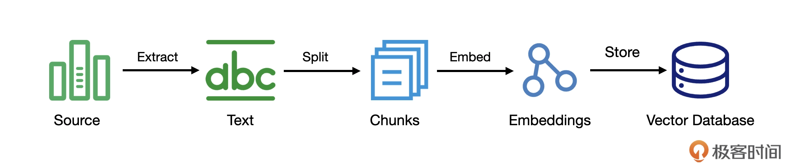

## K6 LangChain：一个AI应用开发生态

LangChain 是一个开发框架，用来开发各种基于大模型的应用。要完整理解LangChain，需要拆分为3个部分：

- 开发框架
- 社区生态
- 扩展生态

### 1. 开发框架

作为一个框架，LangChain 最重要的价值是提供了一些开发应用所需的基础抽象和 LangChain 表达式语言。我们来看一段示例代码：

```
chain = model | parser
chain.invoke(messages)
```

这段代码的核心含义就是将一个一个组件组装到一起，形成一条链，然后，调用这条链。LangChain 应用的代码核心就是构建一条这样的链，这也是
LangChain 这个名字里 Chain 的含义。我们后面会看到的各种代码，本质上就是用各种组件组装出一条链来。

在这段代码中，用到的两个组件是**模型**和**输出结果解析器**。
当我们把消息传给这条链时，它会先调用模型根据消息生成相应的内容，然后，把这个生成的内容传给输出结果解析器，解析成我们需要的格式。

对于`model`，如常见的GPT、claude，在社区都已经实现好了，包括parser也有各种各样的，
我们只需要用上面看到的LangChain表达式语言来定义一段代码，然后，调用这个代码，就可以得到一个自定义的大模型应用了。
例如 model 可以使用 GPT，parser 可以使用JSON解析器，那么输出结果就是JSON格式的。

### 2. 社区生态

社区生态包含了大量的各种针对model和parser的实现，我们首先能想到的就是各种大模型，比如，OpenAI 的 GPT、Anthropic 的 Claude
等等，都有对应的实现，国内的很多大模型也有对应的实现。

除了大模型，其它基础抽象都有很多实现，比如，向量数据库，有 Milvus、FAISS、Qdrant、Chroma 等等，文档加载既可以加载一个 Web
页面，也可以从诸如 S3、微软 OneDrive 加载，甚至从 Twitter、Telegram 加载内容。总之，针对不同的抽象，都有对应的实现，你可以根据自己的需要在
LangChain 的集成页面上找到对应的内容。

如果说前面提到的都是直接的 LangChain 抽象实现，那还有一批实现就跳出了直接实现接口的范畴，这就是**工具**。随着 Agent
的兴起，工具成为了扩展
AI 能力的一种重要手段。天下工具如此之多，社区支持就成为了最好的选择：搜索、**代码解析**、**网页浏览**、**数据库集成**
等等，各种工具五花八门。

### 3. 扩展生态

LangChain 社区蓬勃发展，各种扩展层出不穷，但所有这些扩展都围绕着一个目标，如何构建一个链。除了构建链之外，还有什么其它事情可以做呢？

事实上，LangChain 团队确实在探索更多可做的事情，所以，在了解 LangChain 时，你会看到一些与 LangChain 相关的名字。这就是
LangChain 的拓展生态：

- LangServe，它是把 LangChain 编写的链部署成 REST API 的一个工具。因为我们编写的应用多半是以服务的方式对外提供，LangServe
  简化了 LangChain 应用服务化的门槛。不过，它更多地是面向 LangChain 的使用场景设计的，其提供的服务是否适合你的应用，还是需要根据你自己的情况评估。
- LangSmith，它是 LangChain 团队提供的一个SaaS平台，帮助开发者调试、追踪、测试、评估和监控基于大模型的应用。
- LangGraph，它提供了又一种构建 Agent 的方式，把 Agent 的状态流转构建成一个图。LangChain 团队甚至构建了一个 IDE：LangGraph
  Studio，简化这个图的构建过程。

## K7-LangChain：核心抽象

ChatModel 是LangChain中最核心的抽象。用法如下：

```python
from langchain_community.chat_models import ChatTongyi

# 也可以是厂商自己实现的ChatModel抽象
from langchain_openai import ChatOpenAI
```

ChatModel 可以替代 llm，llm是文字到文字，前者带来更丰富的模式。

## K8-从零实现一个角色扮演的聊天机器人

为了支持聊天历史，LangChain 引入了一个抽象叫 ChatMessageHistory。为了简单，我们这里使用了
InMemoryChatMessageHistory，也就是在内存存放的聊天历史。有了聊天历史，就需要把聊天历史和模型结合起来，这就是
RunnableWithMessageHistory 所起的作用，它就是一个把聊天历史和链封装到一起的一个类。

这里的 Runnable 是一个接口，它表示一个工作单元。我们前面说过，组成链是由一个一个的组件组成的。严格地说，这些组件都实现了
Runnable 接口，甚至链本身也实现了 Runnable 接口，我们之前讨论的 invoke、stream 等接口都是定义在 Runnable 里，可以说，Runnable
是真正的基础类型，LCEL 之所以能够以声明式的方式起作用，Runnable 接口是关键。

不过，在真实的编码过程中，我们很少会直接面对 Runnable，大多数时候我们看见的都是各种具体类型。只是你会在很多具体类的名字中见到
Runnable，这里的 RunnableWithMessageHistory 就是其中一个。

### 1. 支持角色扮演

```python
prompt = ChatPromptTemplate.from_messages(
    [
        (
            "system",
            "你现在扮演孔子的角色，尽量按照孔子的风格回复，不要出现‘子曰’",
        ),
        MessagesPlaceholder(variable_name="messages"),
    ]
)

with_message_history = RunnableWithMessageHistory(
    prompt | chat_model,
    get_session_history
)
```

将提示词模板加入链中即可。

### 2. 支持会话长度限制

如果不加任何限制，所有的聊天历史都会附加到新的会话中，随着聊天的进行，聊天历史很快就会超过大模型的上下文窗口大小。一种典型处理办法是，对聊天历史进行限制。

LangChain 提供了一个 trim_messages 用来控制消息的规模，它提供了很多控制消息规模的参数：

- max_tokens，限制最大的 Token 数量。
- strategy，限制的策略，从前面保留（first），还是从后面保留（last）。
- allow_partial，是否允许把拆分消息。
- include_system，是否要保留最开始的系统提示词。

**max_tokens** 是我们限制消息规模的主要原因。对 OpenAI API 来说，一种常见的解决方案是采用 tiktoken，这是一个专门用来处理的
Token 的程序库。

有了这些基础之后，我们就可以改造一下角色扮演机器人：

```python
from langchain_core.messages import trim_messages

trimmer = trim_messages(
    max_tokens=4096,
    strategy="last",
    token_counter=tiktoken_counter,
    include_system=True,
)

with_message_history = RunnableWithMessageHistory(
    trimmer | prompt | chat_model,
    get_session_history
)
```

### 3. 总结

这一讲，我们构建了一个命令行版的聊天机器人。我们可以通过 ChatMessageHistory 管理聊天历史，然后用 RunnableWithMessageHistory
把它和我们编写的链结合起来。

我们还实现了一个角色扮演类的聊天机器人，关键点就是将提示词模板（PromptTemplate）结合进来。在实际的使用中，我们需要限制传给大模型的消息规模，通过
trim_messages 就可以完成限制消息规模的任务。

## K10-让大模型知道更多东西

如果希望大模型知道我公司的业务知识，这样就可以提高业务效率了。有两种方法：

- 模型微调：使用业务信息对已经训练好的模型进行微调。
- RAG：在上下文中带有业务信息，让大模型据此进行整合。

相比于模型微调，RAG 的方案成本要低一些，而且更加灵活，实现起来也更简单一些，所以，它也成为了现在解决这个问题的首选。这一讲，我们就来了解一下
RAG。

### 1. RAG（检索增强生成）

RAG 是 Retrieval-Augmented Generation 的缩写，也就是检索增强生成。这是什么意思呢？就是通过检索的方式，对要处理的内容进行增强之后再去生成。

RAG 系统处理用户请求的极简流程示意图：



### 2. Indexing-建立向量数据库

RAG中的第一步，就是携带用户查询去数据库中搜索相关内容。这里就开始出现新内容，因为传统搜索是基于文本字面量的精确或模糊搜索，
而大模型中的搜索需求是基于语义的搜索，这就需要向量化搜索登场了。

首先就得有向量化数据库，它在2000年由加州大学伯克利分校的研究人员开始尝试开发向量数据库，用来存储和查询高维向量。2010 年，
VectorWise 公司发布了第一个商业向量数据库。其次，我们要将传统数据库中的内容通过专门的Embedded大模型接口进行向量化转换，
然后存储到向量数据库以供查询，这个过程叫做索引（Indexing）：



当然，源数据不一定是来自传统数据库，也可以是Word 文档、PDF 文件，Web 页面或图片。从这些信息源中，我们需要把内容提取出来，也就是其中的文本。
接下来，我们会把这些文本进行**拆分**，将其拆分成更小的文本块。之所以要拆分，主要是原始的文本可能会比较大，这并不利于检索，还有一点重要原因是，
我们前面说过，要把检索到的信息拼装到提示词里，过大的文本可能会造成提示词超过模型有限的上下文窗口。

### 3. RAG正在发展

RAG 领域正处于一个快速发展的过程中，有很多相关技术也在不断地涌现：

- 虽然采用向量搜索对于语义理解很有帮助，但一些人名、缩写、特定 ID 之类的信息，却是传统搜索的强项，有人提出混合搜索的概念，将二者结合起来；
- 通过各种搜索方式，我们会得到很多的候选内容，但到底哪个与我们的问题更相关，有人引入了**重排序（Rerank）**
  模型，以此决定候选内容与查询问题的相关程度；
- 除了在已有方向的努力，甚至还有人提出了 RAG
  的新方向。我们前面讨论的流程前提条件是把原始信息转换成了向量，但这本质上还是基于文本的，更适合回答一些事实性问题。它无法理解更复杂的关系，比如，
- 我的朋友里谁在 AI 领域里工作。所以，有人提出了基于知识图谱的 RAG，知识图谱是一种结构化的语义知识库，特别适合找出信息之间的关联。

### 4. 总结

RAG主要是为了解决大模型本身知识匮乏的问题。RAG 应用的主要流程包括索引、检索和生成。

## K11-自己动手实现一个RAG应用

RAG 有两个核心的过程，一个是把信息存放起来的索引过程，一个是利用找到相关信息生成内容的检索生成过程。所以，我们这个 RAG
应用也要分成两个部分：索引和检索生成。

下面将代码分步骤拆解。

### 1. 文本拆分转向量

```python
from langchain_community.document_loaders import TextLoader

# 1. 为了演示，使用最简单的 TextLoader 从文本加载
loader = TextLoader("introduction.txt")
docs = loader.load()

# 2. 拆分为合适的大小，以便存储
text_splitter = RecursiveCharacterTextSplitter(chunk_size=1000, chunk_overlap=200)
splits = text_splitter.split_documents(docs)

# 3. 选择 Chroma 作为向量数据库，对开发友好，可以把向量存在指定目录
vectorstore = Chroma(
    collection_name="ai_learning",
    embedding_function=OpenAIEmbeddings(),
    persist_directory="vectordb"
)

# 4. 数据入库
vectorstore.add_documents(splits)
```

这里的 **TextLoader** 属于 DocumentLoader。在 LangChain
中，有一个很重要的概念叫文档（Document），它包括文档的内容（page_content）以及相关的元数据（metadata）。所有原始信息都是文档，索引信息的第一步就是把这些文档加载进来，这就是
DocumentLoader 的作用。

除了这里用到的 TextLoader，LangChain 社区里已经实现了大量的 DocumentLoader，比如，从数据库里加载数据的
SQLDatabaseLoader，从亚马逊 S3 加载文件的 S3FileLoader。基本上，大部分我们需要的文档加载器都可以找到直接的实现。

LangChain 支持了很多的向量数据库，它们都有一个统一的接口：**VectorStore**，在这个接口中包含了向量数据库的统一操作，比如添加、查询之类的。
这个接口屏蔽了向量数据库的差异，在向量数据库并不为所有程序员熟知的情况下，给尝试不同的向量数据库留下了空间。各个具体实现负责实现这些接口，我们这里采用的实现是
Chroma。

### 2. 使用向量数据库搜索

向量数据入库后，可以调用数据库的搜索接口验证结果。

```python
documents = vectorstore.similarity_search("专栏的作者是谁？")
print(documents)
```

这里用的 similarity_search 表示的是根据相似度进行搜索，还可以使用 max_marginal_relevance_search，它会采用 MMR（Maximal
Marginal Relevance，最大边际相关性）算法。这个算法可以在保持结果相关性的同时，尽量选择与已选结果不相似的内容，以增加结果的多样性。

### 3. 总结

这一讲，我们自己动手实现了一个 RAG 应用，主要包括了索引和检索生成两个部分。

在 LangChain 中，有一些支持 RAG 应用的概念：

- 文档（Document），表示各种信息。
- DocumentLoader，将文档加载进来。
- 向量数据库（VectorStore），提供向量数据库的基础操作。
- Embedding，负责将文本向量化。
- TextSplitter，负责切分加载进来的文档。
- Retriever，负责检索文档，供生成使用。