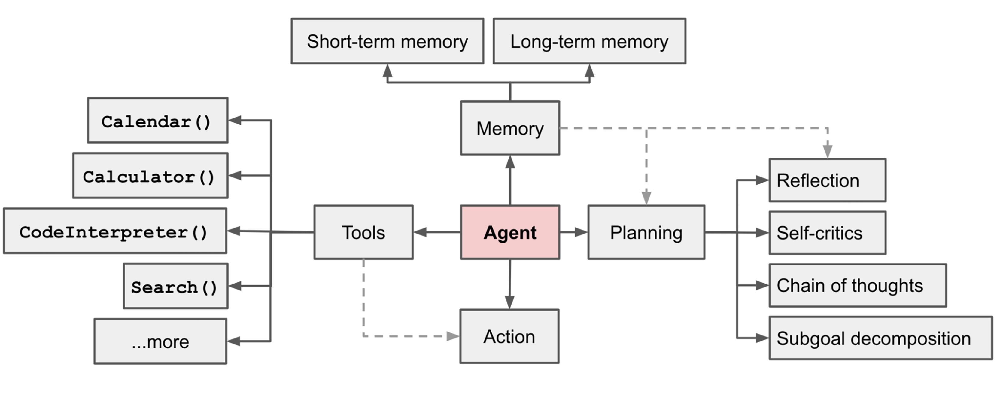

## K1-Agent：从聊天到工作

如果大模型只能实现一个聊天机器人，可就太暴殄天物了。因为我们根本没有最大化的利用到大模型的推理能力。
如果能够赋予大模型一些行动力，那么大模型就可以实现很多事情。例如，我们可以实现一些工具给大模型调用，
比如浏览网页、调用接口、查看日历、执行代码等等。

Agent，就是这样一个东西，翻译为智能代理。Agent的概念起源于大模型之前的AI领域，它的定义是：

```
任何通过传感器（sensor）感知环境（environment），并通过执行器（actuator）作用于该环境的事物都可以视为智能体（agent）。
```

按照这个理解，人是一种智能体，眼睛、耳朵等器官是我们的传感器，手、腿等器官是我们的执行器；机器人是一种智能体，摄像头、红外线测距仪是传感器，各种电机是执行器。
说到这，你可能也想到了，我们开发的软件系统也可以看作一种智能体，我们接受外部的请求，就是在感知环境，回复的应答就是在对环境执行动作。
唯一的不同是我们开发的软件的逻辑规则是固定的，而Agent的逻辑规则是动态的，可以由大模型来决定，相当于有一个智慧的大脑。

直到大模型的出现，人们终于意识到，Agent需要的“好”大脑终于出现了。于是，一大批人开始尝试以大模型为基础，开发新一代的
Agent，这其中最典型就是 AutoGPT。

AutoGPT 刚刚出来的时候，惊艳到了很多人。只需要一个简单提示词，AutoGPT 就能开始自己分析任务、拆解任务乃至执行任务。这远远超出普通人对大模型边界的认知，殊不知，如此表现的
Agent 同样也是人工智能研究领域翘首期盼的，一个好用的新脑。随着 AutoGPT 的流行，各种以大模型为新脑的 Agent 纷纷问世，AI
领域曾经无法很好实现的 Agent 终于可以落地了。

### 1. 大模型如何实现Agent

大模型虽然很好，但它并不是一个完整的 Agent。所以，要想让 Agent 真正落地，我们还需要补充一些组件，下面是一个常见的 Agent
系统概览图：



这里面包含了一些重要的组件：

- 规划（Planning），它负责将大目标分解成小的子目标，也可以对已有行为进行反思和自我改善。
- 记忆（Memory），包括短期记忆和长期记忆，短期记忆提供上下文内的学习，长期记忆则提供长时间保留和回忆信息的能力。
- 工具（Tools），通过调用外部 API 获取外部信息（作为感知器），执行外部动作（作为执行器）。

从这些组件的简介我们不难看出，规划组件的能力是需要智能完成的，这个部分要归属于大脑，在实现中，我们可以让大模型来做这部分工作。在记忆组件中，短期记忆可以用聊天历史的方式解决，而长期记忆，我们可以存放到向量数据库中，采用类似
RAG 的方式解决。工具组件主要是与不同的内容集成，这个部分是程序员最熟悉的部分，属于常规的编码。

### 2. Agent的执行过程

Agent 的处理流程通常会分成两步：规划和执行。

1. 规划：大模型接收用户请求后，会将大任务拆解为小任务（通过提示词），然后逐个执行。
2. 执行：执行每个任务前，一般需要大模型判断任务的有效性、是否需要执行等。提示词可以使用ReAct。ReAct
   会通过思考（Thought）、行动（Action）、观察（Observation）三个阶段进行任务处理。通常我们会循环这个过程，直到通过观察，判断需要结束。

再具体一点：

1. 用户请求：发送需求（今天天气怎么样？）和提示词模板（包含我们能够提供的工具能力描述、短期记忆、长期记忆【搜索得来】）给大模型。
2. 执行：大模型进行任务拆解，逐个执行小任务，比如生成查询天气接口的参数，调用接口，获取结果，将结果保存到短期记忆中。大模型会对执行结果进行判断，
   如果结果合理，会自动停下返回答案。

可以看到 Agent 的执行过程本质上是一个循环，一直会执行到大模型认为应该结束为止。所以，一旦控制不好，Agent
执行过程成本是非常高的。从实践的角度，有时我们会控制一下循环的次数。

人工智能领域对 Agent 的探索，实际上，人们在这个方向走出了很远，比如，多个任务的并行执行、分布式 Agent、多智能体协调等等。

### 2. 市场中的Agent

参考2023年文章 [万字长文 | 全球AI Agent大盘点，大语言模型创业一定要参考的60个AI智能体](https://www.thepaper.cn/newsDetail_forward_24763047)。